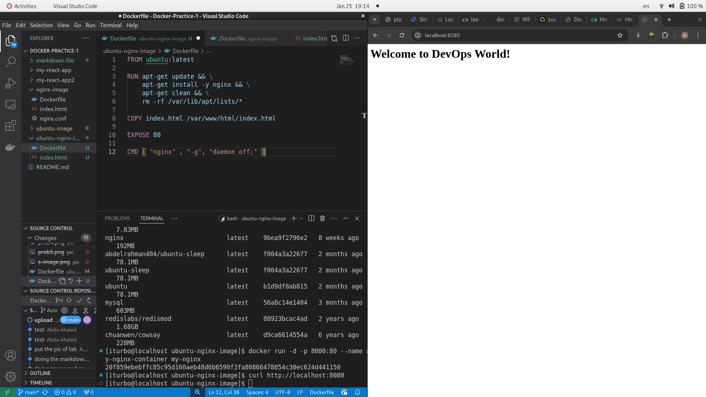
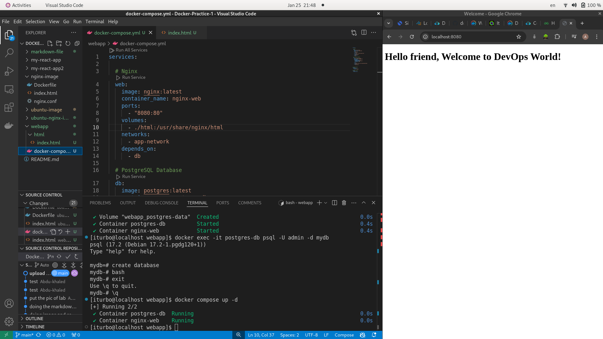

## A) Docker Fundamentals

**What is a Doker container, and how is it different from a virtual machine (VM) ?**

A: Container are packages of software that contian all of the necessary elements to run in any enviroment. In this way, containers virtualize the operating system and run anywhere. Virtual machines access the hardware of physcial machine through a hypervisor. The hypervisor create an abstraction layer allowing the VM to access CPU, memory and storage. Containers, on the other hand, represent a package that includes an executable with the dependencies it needs to run.

***

***What is the purpose of Dockerfile? Explain the significance of directives like FORM, COPY, RUN and CMD.***

A: Docker can build the images automatically by reading the instructions from a Dockerfile. A Docker file is a text document that contains all the commands a user could call on the command line to assemble an image. 

FROM: The FROM instruction specifies the base iamge from which you are building.

COPY: Command enable the transfer of files from the host to the container's filesystem.

RUN: Executes commands specified during build step of the container. It can be used to install necessary packages, update exiting packes and ...etc 

CMD: Provide default commands to be executed when a Docker image is run as a container. 

***

## B) Image Management

***Describe the layers of a Docker image. How does Docker optimize space and performance using these layers?***

A: A Docker image is composed of multiple layers stacked on the top of each other. Each layer represents a dpecific modification to the file system (inside the container), such as adding a new file or modifying an exiting one. Docker's layered architecture ensures space efficiency by sharing and reusing layers, minimizes network bandwidth by transferring only necessary changes, and enhances performance by using caching and union file systems. This design is fundamental to Docker's scalability and efficiency.

***

***What are the benefits of using Docker volumes? Give an example where data persistence is crucial in a Docker container.***

1. Data Persistence
- Volumes store data independently of the container lifecycle, meaning the data persists even if the container is deleted or recreated.

2. Data Sharing
- Multiple containers can share a single volume, making it easy to share data between containers.

3. Performance
- Volumes are optimized for Docker's I/O operations, often offering better performance compared to bind mounts (host file system).

4. Isolation
- Volumes are managed by Docker, so they are isolated from the host file system, reducing the risk of accidental modifications.

5. Backup and Restore
- Volumes are easy to back up and restore, ensuring data recovery in case of failure.

6. Portability
- Volumes make it easier to move or replicate containerized applications with their data across environments.


***

## C)

**How does Docker handle networking? Explain the difference between bridge, host, and none network modes in Docker.***

A: Docker containers are attached to virtual networking, allowing them to interact in various ways. Docker achives this by using linux kernel feature sucha as network namespaces and virtual network bridge. when you run a container, Docker assigns it a network namespace, isolating its network stack from the host and other containers unless explicitly configured otherwise.

1. Bridge Mode (Default Mode)
- The bridge network is Docker's default networking mode for standalone containers. Docker creates a private virtual bridge network (usually called docker0) on the host, and all containers connected to it can communicate with each other.

- Containers get their own private IP addresses on the bridge network.

- Communication between containers:
   - Possible within the same bridge network using container names or IPs.
 

2. Host Mode

- In host mode, the container shares the host's network stack. The container does not get its own network namespace, and it uses the host's IP address and ports directly.

- No port mapping is required (e.g., -p flag has no effect). The container can bind to any port on the host's network.


3. None Mode

- In none mode, the container has no network interface other than a loopback interface (localhost or 127.0.0.1). It cannot connect to the external network or communicate with other containers.


***

***Describe how you would configure container-to-container communication within a Docker network.***

1. Create Network 

```
docker network create my-network
```

2. Run Container 

```
docker run -d --name container1 --network my-network nginx
docker run -d --name container2 --network my-network alpine
```

3. Test Communication 
```
docker exec -it container2 ping container1
```

4. Clean up

```
docker stop container1 container2
docker rm container1 container2
docker network rm my-network6
```

***

## Practical Labs 

a) Dockerfile Creation
    • Write a Dockerfile that:
        ◦ Uses Ubuntu as the base image.
        ◦ Installs Nginx and serves a custom index.html file.
        ◦ Exposes port 8080 and starts Nginx in the foreground.
        ◦ The index.html file should display a custom message, such as "Welcome to DevOps World!"
    • Build the Docker image and verify its functionality




*** 

b) Multi-Container Setup
    • Create a Docker Compose file to set up a simple web application stack:
        ◦ One container running an Nginx web server.
        ◦ One container running a PostgreSQL database.
        ◦ Ensure that the web server can communicate with the database container, and the database is persistent using a Docker volume.



***

c) Resource Limiting
    • Run your web server container with memory and CPU usage limits (e.g., limit the container to use a maximum of 512MB memory and 1 CPU core).

```
docker run -d \
  --name nginx-web \
  --memory="512m" \
  --cpus="1" \
  -p 8080:80 \
  nginx:latest
```

• Provide the command you used and explain how Docker resource limits can help in a production environment.


1. Prevent Resource Exhaustion:
   By setting memory and CPU limits, you ensure that a single container cannot consume all available resources on the host, which could starve other containers or critical system processes.


2. Improve Stability:
   Resource limits prevent runaway processes or memory leaks in a container from crashing the entire host or affecting other containers.


3. Fair Resource Allocation:
   In a multi-tenant environment (e.g., running multiple containers on the same host), resource limits ensure fair allocation of CPU and memory among all containers.


4. Cost Optimization:
   By limiting resource usage, you can run more containers on the same host, optimizing infrastructure costs.

5. Easier Scaling:
   Resource limits make it easier to predict the performance and capacity of your containers, which is critical for scaling applications in production.


6. Compliance with SLAs:
   Enforcing resource limits helps ensure that your application meets performance and availability Service Level Agreements (SLAs).


***

(https://github.com/Abdu-khaled/Docker-Labs.git "Link of repo Lab)